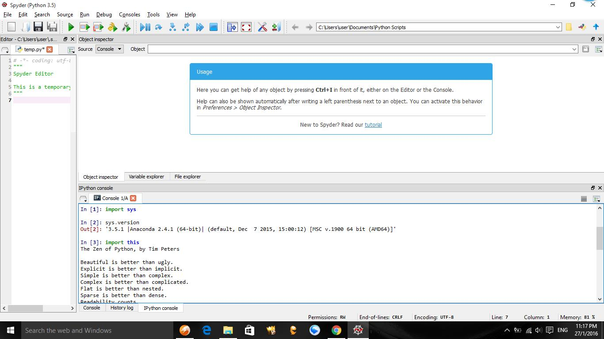

UECM3033 Assignment #1 Report
========================================================

- Prepared by: NG KE JIE
- Tutorial Group: T2

--------------------------------------------------------

## Task 1 -- setup a github repository

The reports, codes and supporting documents are uploaded to Github at: 

https://github.com/NGKEJIE/UECM3033_assign1

---------------------------------------------------------

## Task 2 -- setup python

Put here the screen shot of file (python.png)

------------------------------------------------------------

## Task 3 -- modify and run Python script

In this section, please report:

1. The hexadecimal value of your student ID.

   Hexadecimal representation of 1405676 is 0x1572ec

2. Write down the definite integrals that you have chosen.
   
$$\int_0^{\infty} x^{\frac{1}{2}}*\sin(x^{\frac{3}{2}}+1) dx = 2^{\frac{2}{3}}*\sin(1)*\frac{\gamma(\frac{2}{3})}{12} + 2^{\frac{2}{3}}*\pi*\frac{\cos(1)}{(18*gamma(\frac{4}{3})}.$$

3. Write down your system of 10 linear equations.

\begin{align*}
0 x_0 + 3 x_1 + 5 x_2 + 9 x_3 + 2 x_4 + 4 x_5 + 7 x_6 + 2 x_7+ 0 x_8 + 8 x_9 &= 5,\\
0 x_0 + 3 x_1 + 7 x_2 + 0 x_3 + 2 x_4 + 6 x_5 + 8 x_6 + 0 x_7+ 2 x_8 + 9 x_9 &= 9,\\
3 x_0 + 4 x_1 + 1 x_2 + 8 x_3 + 3 x_4 + 0 x_5 + 0 x_6 + 4 x_7+ 1 x_8 + 8 x_9 &= 0,\\
4 x_0 + 0 x_1 + 2 x_2 + 5 x_3 + 0 x_4 + 2 x_5 + 6 x_6 + 0 x_7+ 2 x_8 + 2 x_9 &= 1,\\
0 x_0 + 0 x_1 + 0 x_2 + 4 x_3 + 1 x_4 + 8 x_5 + 2 x_6 + 0 x_7+ 4 x_8 + 9 x_9 &= 6,\\
3 x_0 + 6 x_1 + 8 x_2 + 1 x_3 + 0 x_4 + 0 x_5 + 0 x_6 + 1 x_7+ 6 x_8 + 9 x_9 &= 9,\\
2 x_0 + 3 x_1 + 6 x_2 + 8 x_3 + 0 x_4 + 1 x_5 + 7 x_6 + 0 x_7+ 0 x_8 + 0 x_9 &= 1,\\
0 x_0 + 4 x_1 + 7 x_2 + 9 x_3 + 1 x_4 + 5 x_5 + 3 x_6 + 8 x_7+ 2 x_8 + 0 x_9 &= 2,\\
0 x_0 + 3 x_1 + 1 x_2 + 0 x_3 + 0 x_4 + 1 x_5 + 4 x_6 + 0 x_7+ 5 x_8 + 0 x_9 &= 6,\\
3 x_0 + 0 x_1 + 5 x_2 + 0 x_3 + 1 x_4 + 4 x_5 + 0 x_6 + 0 x_7+ 1 x_8 + 0 x_9 &= 3.
\end{align*}

-----------------------------------

last modified: 29/1/2016 
